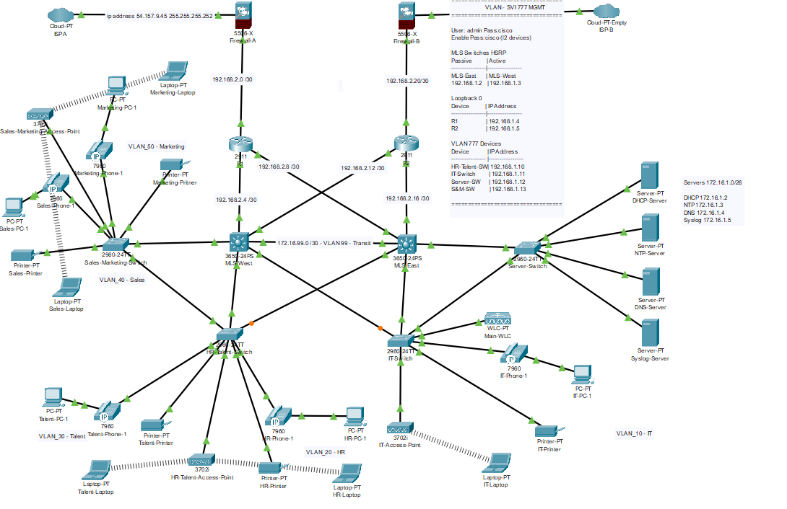

# 🖧 Personal Project – Project #4
**Project to explore other CCNA Topics / Interests.**  

---

## 📝 Project Description
This project focuses on designing and implementing a secure, resilient, and centrally managed network. Key objectives include:

- Deploying centralized servers to manage core services efficiently.  
- Implementing a Wireless LAN Controller (WLC) for centralized wireless network management.  
- Configuring a firewall to protect the network perimeter.  
- Performing NAT overload / dynamic NAT for Internet access.  
- Setting up a loopback interface for network management.  
- Enabling Dynamic ARP Inspection (DAI) and DHCP snooping on Layer 2 devices for enhanced security.  
- Configuring SVIs with HSRP to provide gateway redundancy.  
- Incorporating redundant links to ensure high availability and failover.  
- Implementing Access Control Lists (ACLs) to control and filter traffic.  
- Applying security best practices and hardening measures across all network devices.

---

## 🛠️ Technologies Implemented
The following technologies were implemented across the network:

- VLANs  
- Trunks (allowed VLANs, native VLAN, nonegotiate)  
- Port Security (sticky MAC, max MAC addresses, violation restrict)  
- Spanning-Tree Protocol (PVST, PortFast, BPDU Guard, extend system ID)  
- DHCP Snooping  
- Dynamic ARP Inspection (DAI)  
- 802.1X authentication  
- SSH access control with ACLs  
- Syslog centralized logging  
- NTP with authentication  
- Login and MOTD banners  
- Shutdown / secure unused ports  
- OSPF routing  
- Static routes (backup/failover routes)  
- HSRP / gateway redundancy  
- Layer 3 inter-VLAN routing  
- NAT (dynamic, firewall)  
- Firewall ACLs / stateful inspection  
- Application-layer inspection (DNS, FTP, TFTP)  
- AAA authentication for management access  
- Telnet hardening/restriction

---

## 📁 Files in Repository
- `Configs` – Router and Switch Configs  
- `Diagrams` – Network Diagrams  
- `PKT` – Packet Tracer Project File  
- `Test_Results` – Test Screenshots  

---

## Author
**Ryan** – Network Engineer Aspirant / CCNA Prep 
